# SGCT Rendering Pipeline

This document describes the rendering pipeline in SGCT (Simple Graphics Cluster Toolkit), with particular attention to framebuffers and texture bindings at each callback execution point.

## Pipeline Overview

The SGCT rendering pipeline is a multi-stage process that handles various rendering modes including mono, stereo, and non-linear projections (fisheye, cylindrical, etc.). The pipeline manages multiple framebuffers and textures to support these different modes.

## Mermaid Diagram

```mermaid
flowchart TD
    Start([Engine::exec - Main Loop]) --> PollEvents[GLFW Poll Events]
    PollEvents --> PreSync{PreSync Callback}
    
    PreSync -->|FBO: None<br/>Textures: None| EncodeData[Encode Shared Data<br/>Master Only]
    EncodeData --> FrameLockPre[Frame Lock Pre-Stage<br/>Network Sync]
    FrameLockPre --> UpdateWindows[Update All Windows]
    UpdateWindows --> PostSyncPreDraw{PostSyncPreDraw Callback}
    
    PostSyncPreDraw -->|FBO: None<br/>Textures: None| StartStats[Start Statistics Timer]
    StartStats --> WindowDraw[For Each Window:<br/>Window::draw]
    
    WindowDraw --> CheckStereo{Stereo Mode?}
    
    CheckStereo -->|No Stereo| MonoPath[Render Mono Path]
    CheckStereo -->|Stereo Active| StereoPath[Render Stereo Path]
    
    MonoPath --> CheckNonLinear{Has Non-Linear<br/>Viewports?}
    StereoPath --> RenderLeftNonLinear{Has Non-Linear<br/>Viewports Left?}
    
    RenderLeftNonLinear -->|Yes| RenderCubemapLeft[renderCubemap<br/>FrustumMode::StereoLeft]
    RenderLeftNonLinear -->|No| RenderLeftViewports
    
    RenderCubemapLeft --> RenderCubeFaces[For Each Cube Face 0-5]
    RenderCubeFaces -->|FBO: _cubeMapFbo<br/>Textures: cubeMapColor, cubeMapDepth<br/>attached per face| CubeFaceClear[Clear Color & Depth]
    CubeFaceClear --> DrawCubeFace{Draw Callback}
    DrawCubeFace -->|FBO: _cubeMapFbo<br/>RenderData: cubemap resolution<br/>ViewProjection: cube face| DrawUser3DCube[User Draw Function<br/>for Cube Face]
    DrawUser3DCube --> BlitMSAA1{MSAA Enabled?}
    BlitMSAA1 -->|Yes| BlitCubeFace[Blit MSAA to Texture]
    BlitMSAA1 -->|No| NextCubeFace
    BlitCubeFace --> NextCubeFace{More Faces?}
    NextCubeFace -->|Yes| RenderCubeFaces
    NextCubeFace -->|No| DepthCorrection{Depth Texture<br/>Enabled?}
    DepthCorrection -->|Yes| CorrectDepth[Apply Depth Correction<br/>Shader]
    CorrectDepth --> RenderLeftViewports
    DepthCorrection -->|No| RenderLeftViewports
    
    CheckNonLinear -->|Yes| RenderCubemapMono[renderCubemap<br/>FrustumMode::Mono]
    RenderCubemapMono --> RenderCubeFacesMono[Same as Stereo<br/>Cube Face Rendering]
    RenderCubeFacesMono --> RenderMonoViewports
    CheckNonLinear -->|No| RenderMonoViewports
    
    RenderLeftViewports --> RenderViewportsLeft[renderViewports<br/>FrustumMode::StereoLeft<br/>Eye::MonoOrLeft]
    RenderMonoViewports --> RenderViewportsMono[renderViewports<br/>FrustumMode::Mono<br/>Eye::MonoOrLeft]
    
    RenderViewportsLeft --> BindFinalFBOLeft
    RenderViewportsMono --> BindFinalFBOMono
    
    BindFinalFBOLeft -->|FBO: _finalFBO| AttachLeftEye[Attach Textures:<br/>GL_COLOR_ATTACHMENT0: leftEye<br/>GL_COLOR_ATTACHMENT1: normals optional<br/>GL_COLOR_ATTACHMENT2: positions optional<br/>Depth: depth texture optional]
    BindFinalFBOMono -->|FBO: _finalFBO| AttachMonoEye[Attach Textures:<br/>GL_COLOR_ATTACHMENT0: leftEye<br/>GL_COLOR_ATTACHMENT1: normals optional<br/>GL_COLOR_ATTACHMENT2: positions optional<br/>Depth: depth texture optional]
    
    AttachLeftEye --> ForEachViewportLeft[For Each Viewport]
    AttachMonoEye --> ForEachViewportMono[For Each Viewport]
    
    ForEachViewportLeft --> SetupViewportLeft[Setup Viewport & Scissor]
    ForEachViewportMono --> SetupViewportMono[Setup Viewport & Scissor]
    
    SetupViewportLeft --> ClearViewportLeft[Clear Color & Depth]
    SetupViewportMono --> ClearViewportMono[Clear Color & Depth]
    
    ClearViewportLeft --> Draw3DLeft{Draw Callback}
    ClearViewportMono --> Draw3DMono{Draw Callback}
    
    Draw3DLeft -->|FBO: _finalFBO bound<br/>RenderData: viewport data| DrawUser3DLeft[User Draw Function]
    Draw3DMono -->|FBO: _finalFBO bound<br/>RenderData: viewport data| DrawUser3DMono[User Draw Function]
    
    DrawUser3DLeft --> MoreViewportsLeft{More Viewports?}
    DrawUser3DMono --> MoreViewportsMono{More Viewports?}
    
    MoreViewportsLeft -->|Yes| ForEachViewportLeft
    MoreViewportsMono -->|Yes| ForEachViewportMono
    
    MoreViewportsLeft -->|No| BlitMSAALeft{MSAA?}
    MoreViewportsMono -->|No| BlitMSAAMono{MSAA?}
    
    BlitMSAALeft -->|Yes| BlitAALeft[Blit MSAA FBO to<br/>Regular FBO]
    BlitMSAAMono -->|Yes| BlitAAMono[Blit MSAA FBO to<br/>Regular FBO]
    
    BlitMSAALeft -->|No| FXAALeft{FXAA?}
    BlitAALeft --> FXAALeft
    BlitMSAAMono -->|No| FXAAMono{FXAA?}
    BlitAAMono --> FXAAMono
    
    FXAALeft -->|Yes| ApplyFXAALeft[Apply FXAA to<br/>intermediate texture]
    FXAAMono -->|Yes| ApplyFXAAMono[Apply FXAA to<br/>intermediate texture]
    
    FXAALeft -->|No| Render2DLeft
    ApplyFXAALeft --> Render2DLeft
    FXAAMono -->|No| Render2DMono
    ApplyFXAAMono --> Render2DMono
    
    Render2DLeft[render2D Left Eye] --> For2DViewportsLeft[For Each Viewport]
    Render2DMono[render2D Mono] --> For2DViewportsMono[For Each Viewport]
    
    For2DViewportsLeft --> Overlay2DLeft{Overlay Texture?}
    For2DViewportsMono --> Overlay2DMono{Overlay Texture?}
    
    Overlay2DLeft -->|Yes| RenderOverlayLeft[Render Overlay Texture]
    Overlay2DMono -->|Yes| RenderOverlayMono[Render Overlay Texture]
    
    Overlay2DLeft -->|No| Stats2DLeft{Statistics?}
    RenderOverlayLeft --> Stats2DLeft
    Overlay2DMono -->|No| Stats2DMono{Statistics?}
    RenderOverlayMono --> Stats2DMono
    
    Stats2DLeft -->|Yes| RenderStatsLeft[Render Statistics]
    Stats2DMono -->|Yes| RenderStatsMono[Render Statistics]
    
    Stats2DLeft -->|No| Draw2DCallbackLeft{Draw2D Callback?}
    RenderStatsLeft --> Draw2DCallbackLeft
    Stats2DMono -->|No| Draw2DCallbackMono{Draw2D Callback?}
    RenderStatsMono --> Draw2DCallbackMono
    
    Draw2DCallbackLeft -->|Yes| UserDraw2DLeft
    Draw2DCallbackMono -->|Yes| UserDraw2DMono
    
    UserDraw2DLeft[User Draw2D Function] -->|FBO: _finalFBO<br/>RenderData: viewport data| More2DViewportsLeft{More Viewports?}
    UserDraw2DMono[User Draw2D Function] -->|FBO: _finalFBO<br/>RenderData: viewport data| More2DViewportsMono{More Viewports?}
    
    Draw2DCallbackLeft -->|No| More2DViewportsLeft
    Draw2DCallbackMono -->|No| More2DViewportsMono
    
    More2DViewportsLeft -->|Yes| For2DViewportsLeft
    More2DViewportsMono -->|Yes| For2DViewportsMono
    
    More2DViewportsLeft -->|No| CheckRightEye{Render Right Eye?}
    More2DViewportsMono -->|No| WindowRenderFBO
    
    CheckRightEye -->|Yes| RenderRightNonLinear{Has Non-Linear<br/>Viewports Right?}
    CheckRightEye -->|No| WindowRenderFBO
    
    RenderRightNonLinear -->|Yes| RenderCubemapRight[renderCubemap<br/>FrustumMode::StereoRight]
    RenderRightNonLinear -->|No| RenderRightViewports
    
    RenderCubemapRight --> RenderCubeFacesRight[Same Cube Face Process]
    RenderCubeFacesRight --> RenderRightViewports
    
    RenderRightViewports --> RenderViewportsRight[renderViewports<br/>FrustumMode::StereoRight]
    RenderViewportsRight --> SideBySideCheck{Side-by-Side or<br/>Top-Bottom?}
    
    SideBySideCheck -->|Yes| RightToLeftEye[Write to leftEye texture<br/>different viewport area]
    SideBySideCheck -->|No| RightToRightEye[Write to rightEye texture]
    
    RightToLeftEye --> SkipRight2D[Skip right 2D for now]
    RightToRightEye --> Render2DRight[Similar to Left 2D]
    
    SkipRight2D --> WindowRenderFBO
    Render2DRight --> Render2DLeftAgain[render2D Left Again for stats]
    Render2DLeftAgain --> WindowRenderFBO
    
    WindowRenderFBO[Window::renderFBOTexture] --> UnbindFBO[Unbind OffScreenBuffer]
    UnbindFBO --> SetBackBuffer[Set GL_BACK buffer<br/>Viewport to window size]
    SetBackBuffer --> ClearBackBuffer[Clear Back Buffer]
    
    ClearBackBuffer --> CheckStereoMode{Stereo Mode?}
    
    CheckStereoMode -->|Quad Buffer| QuadBufferPath[Bind FBO Quad Shader]
    CheckStereoMode -->|Passive/Anaglyph| PassivePath[Bind Stereo Shader]
    CheckStereoMode -->|Mono/Active/Side-by-Side| MonoActivePath[Bind FBO Quad Shader]
    
    QuadBufferPath --> BindLeftTexture[GL_TEXTURE0: leftEye texture]
    PassivePath --> BindBothTextures[GL_TEXTURE0: leftEye<br/>GL_TEXTURE1: rightEye]
    MonoActivePath --> BindLeftTextureMono[GL_TEXTURE0: leftEye texture]
    
    BindLeftTexture --> RenderWarpLeft[For Each Viewport:<br/>renderWarpMesh]
    BindBothTextures --> RenderWarpStereo[For Each Viewport:<br/>renderWarpMesh with stereo]
    BindLeftTextureMono --> RenderWarpMono[For Each Viewport:<br/>renderWarpMesh]
    
    RenderWarpLeft -->|No FBO bound<br/>Drawing to back buffer| ActiveRightCheck{Active Stereo?}
    RenderWarpStereo -->|No FBO bound<br/>Drawing to back buffer| RenderMasks
    RenderWarpMono -->|No FBO bound<br/>Drawing to back buffer| RenderMasks
    
    ActiveRightCheck -->|Yes| RenderRightActive[Clear & bind rightEye<br/>renderWarpMesh to right buffer]
    ActiveRightCheck -->|No| RenderMasks
    
    RenderRightActive --> RenderMasks
    
    RenderMasks{Has Masks?} -->|Yes| ApplyBlendMask[Apply Blend Masks<br/>GL_TEXTURE0: blend mask textures]
    RenderMasks -->|No| SpoutCheck
    
    ApplyBlendMask --> ApplyBlackLevel[Apply Black Level Masks]
    ApplyBlackLevel --> SpoutCheck
    
    SpoutCheck{Spout/NDI?} -->|Yes| ShareTexture[Share leftEye texture<br/>via Spout/NDI]
    SpoutCheck -->|No| PostDraw
    
    ShareTexture --> PostDraw{PostDraw Callback}
    
    PostDraw -->|FBO: None<br/>Back buffer ready| UserPostDraw[User PostDraw Function]
    
    UserPostDraw --> FrameLockPost[Frame Lock Post-Stage<br/>Wait for all nodes]
    
    FrameLockPost --> SwapBuffers[For Each Window:<br/>glfwSwapBuffers]
    
    SwapBuffers --> TakeScreenshot{Screenshot?}
    
    TakeScreenshot -->|Yes| CaptureScreen[Capture from back buffer<br/>or texture]
    TakeScreenshot -->|No| UpdateResolutions
    
    CaptureScreen --> UpdateResolutions[Update Window Resolutions]
    UpdateResolutions --> CheckTerminate{Terminate?}
    
    CheckTerminate -->|No| PollEvents
    CheckTerminate -->|Yes| CleanupCallback{Cleanup Callback}
    
    CleanupCallback -->|FBO: None<br/>Shared context active| UserCleanup[User Cleanup Function]
    UserCleanup --> End([End])
    
    style DrawCubeFace fill:#ff9999
    style Draw3DLeft fill:#ff9999
    style Draw3DMono fill:#ff9999
    style Draw2DCallbackLeft fill:#99ff99
    style Draw2DCallbackMono fill:#99ff99
    style PreSync fill:#9999ff
    style PostSyncPreDraw fill:#9999ff
    style PostDraw fill:#9999ff
    style CleanupCallback fill:#9999ff
```

## Framebuffer and Texture State at Each Callback

### 1. PreSync Callback
- **FBO Bound**: None (shared context)
- **Textures Bound**: None
- **Purpose**: Prepare data for synchronization across cluster
- **Notes**: Called before any rendering, network sync happens after this

### 2. PostSyncPreDraw Callback
- **FBO Bound**: None (shared context)
- **Textures Bound**: None
- **Purpose**: Update state after sync but before rendering
- **Notes**: Data from master is now available on all nodes

### 3. Draw Callback (3D Rendering)

#### For Non-Linear Projections (Cubemap rendering):
- **FBO Bound**: `_cubeMapFbo` (from NonLinearProjection)
- **Textures Attached**:
  - `GL_COLOR_ATTACHMENT0`: Cube map face of `cubeMapColor` texture
  - Depth: Cube map face of `cubeMapDepth` texture
  - Optional: `cubeMapNormals`, `cubeMapPositions` if enabled
- **Resolution**: Cubemap resolution (typically 512-2048 per face)
- **Called**: Once per cube face (6 times) per viewport per eye
- **Purpose**: Render scene from each cube face direction

#### For Regular Viewports:
- **FBO Bound**: `_finalFBO` (from Window)
- **Textures Attached**:
  - `GL_COLOR_ATTACHMENT0`: `leftEye` or `rightEye` texture
  - `GL_COLOR_ATTACHMENT1`: `normals` texture (if `useNormalTexture` enabled)
  - `GL_COLOR_ATTACHMENT2`: `positions` texture (if `usePositionTexture` enabled)
  - Depth: `depth` texture (if `useDepthTexture` enabled)
- **Resolution**: Window framebuffer resolution
- **Called**: Once per viewport per eye
- **Purpose**: Render main 3D scene content

### 4. Draw2D Callback (2D Overlay Rendering)
- **FBO Bound**: `_finalFBO` (from Window)
- **Textures Attached**: Same as Draw callback (above)
- **Additional Textures Bound**:
  - Statistics graphs may bind their own textures
  - Overlay textures if configured per viewport
- **Purpose**: Render 2D overlays, HUDs, text that won't be filtered by post-FX
- **Notes**: Called after FXAA and post-processing effects

### 5. PostDraw Callback
- **FBO Bound**: None (rendering complete, back buffer active)
- **Textures Bound**: None (but final image is in back buffer)
- **Purpose**: Final operations before buffer swap
- **Notes**: Screenshot capture happens after this if requested

### 6. Cleanup Callback
- **FBO Bound**: None (shared context active)
- **Textures Bound**: None
- **Purpose**: Clean up resources before shutdown
- **Notes**: Last callback before SGCT destroys OpenGL contexts

## Key Framebuffer Objects

### Window Level FBOs:
1. **`_finalFBO`**: Main framebuffer for regular viewport rendering
   - Contains color, depth, normal, position attachments
   - May be multisampled (MSAA)
   - Used for standard viewport rendering

2. **Frame Buffer Textures** (`_frameBufferTextures`):
   - `leftEye`: Left eye or mono color output
   - `rightEye`: Right eye color output (stereo only)
   - `depth`: Depth buffer texture
   - `normals`: Normal buffer (optional)
   - `positions`: Position buffer (optional)
   - `intermediate`: Intermediate texture for FXAA

### Non-Linear Projection FBOs:
3. **`_cubeMapFbo`**: Cubemap rendering framebuffer
   - Used for fisheye, cylindrical, equirectangular projections
   - Renders to cube map textures
   - May be multisampled

4. **Cube Map Textures**:
   - `cubeMapColor`: RGB color cube map
   - `cubeMapDepth`: Depth cube map
   - `cubeMapNormals`: Normal cube map (optional)
   - `cubeMapPositions`: Position cube map (optional)
   - `colorSwap`, `depthSwap`: Temporary textures for depth correction

## Rendering Pipeline Flow

1. **Pre-render**: Callbacks execute with no FBO bound
2. **Cubemap Generation** (if non-linear projection):
   - Bind `_cubeMapFbo`
   - Render to each cube face
   - Call Draw callback 6 times (once per face)
3. **Viewport Rendering**:
   - Bind `_finalFBO`
   - Render each viewport
   - Call Draw callback once per viewport
4. **Post-processing**:
   - MSAA resolve (blit)
   - FXAA (if enabled)
5. **2D Rendering**:
   - Still in `_finalFBO`
   - Render overlays, statistics
   - Call Draw2D callback
6. **Final Compositing**:
   - Unbind all FBOs (render to back buffer)
   - Apply warp meshes
   - Apply blend/black level masks
   - Combine stereo views if needed
7. **Buffer Swap**:
   - Call PostDraw callback
   - Swap buffers
   - Optionally capture screenshot

## Stereo Rendering Modes

### Active Stereo (Quad Buffer)
- Renders left and right eyes to separate textures
- Composites both to back buffer using GL_BACK_LEFT and GL_BACK_RIGHT

### Passive Stereo (Side-by-Side, Top-Bottom)
- Renders both eyes to the same `leftEye` texture in different regions
- Composites to full back buffer

### Anaglyph/Checkerboard
- Uses stereo shader to combine left and right eye textures
- Applies color filtering or pixel patterns

## Important Notes

1. **Context Switching**: The shared context is made current between window rendering operations
2. **Texture Attachment**: Textures are dynamically attached to FBOs based on settings
3. **MSAA Handling**: If MSAA is enabled, an additional blit step resolves the multisampled buffer
4. **Viewport Independence**: Each viewport maintains its own projection and can be rendered independently
5. **Cluster Synchronization**: Frame locks ensure all nodes render in sync
6. **Screenshot Timing**: Screenshots are captured from the back buffer after swap but before the frame completes
